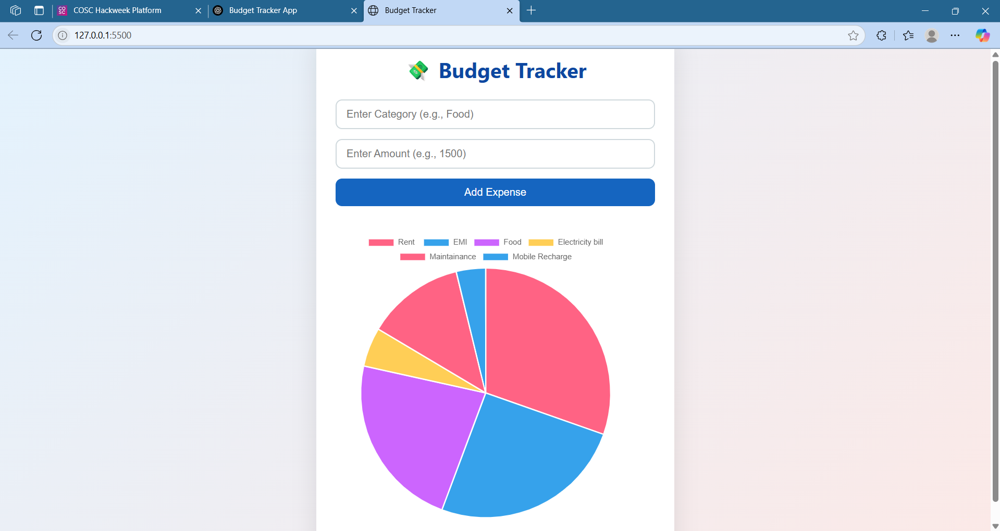

# Budget Tracker – Expense Pie Chart

A simple and responsive web application that allows users to input daily expenses and visualize them in a pie chart using **Chart.js**.

---

## Features

- Add expense categories and amounts dynamically
- Pie chart visualization using Chart.js
- Stylish and responsive UI
- Real-time chart updates with each new entry

---

## Live Demo

🔗 [Click here to view the live demo](https://jailakshmi7683.github.io/budget-tracker/)

---

## 🔧 Technologies Used

- HTML5
- CSS3
- JavaScript (Vanilla)
- [Chart.js](https://www.chartjs.org/)

---

## 📋 How to Use

1. **Clone the repository**
   ```bash
   git clone https://github.com/your-username/budget-tracker.git
   cd budget-tracker
````

2. **Open the app**

   * Open `index.html` in your browser, OR
   * Use Live Server in VS Code

3. **Enter data**

   * Fill in an expense **category** and **amount**
   * Click **"Add Expense"**
   * Watch the pie chart update instantly!

---

## 🖼️ Screenshot



---
## ✍️ Author

**Your Name**
GitHub: [@your-username](https://github.com/jailakshmi7683)
